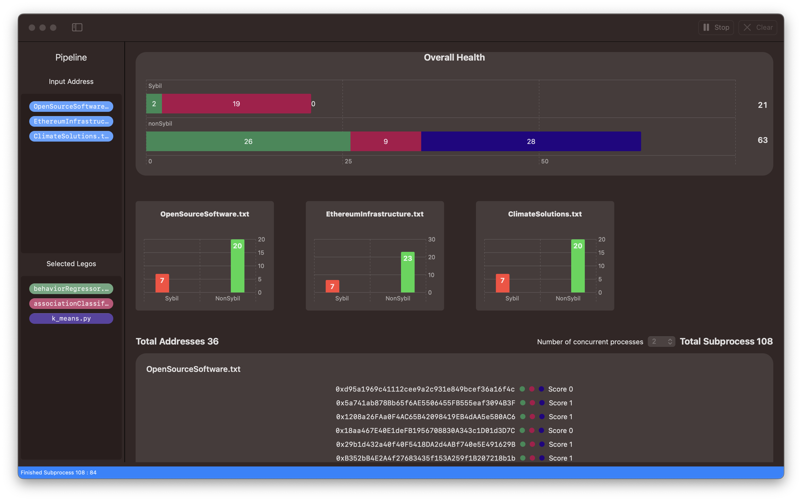
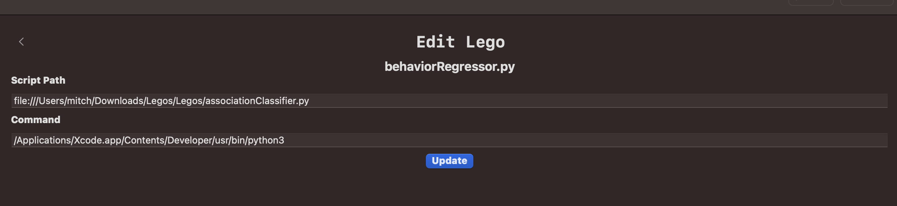

 # Sybil Hunter 


This project is part of the OpenData Community "DataBuilders" Hackathon 2023. Goal of this project is to package algorithms into 'legos' that can be used to evaluate an address based on sybil behavior. Additionally an macOS app extends the capabilities, by enabling a custom pipeline to be create from 'legos' and data sets. The pipeline processes and displays sybil information on a dashboard.

---
  * [About](#sybil-hunter)
  * [Anti-Sybil Dashboard ](#anti-sybil-dashboard )
    + [Quick Start](#quick-start)
    + [Running a Lego](#running-a-lego)
  * [Packaged Legos](#packaged-legos)
    + [Kmeans Cluster](#kmeans-Cluster)
    + [Association Classifier ](#association-classifier )
    + [Behavior Regressor](#behavior-regressor )
    + [Model Training](#model-training)
  * [Licence](#potential-shortcomings)


---

## Requirements

* Python3 3.9.6 

* macOS v13.0
* Xcode v14.2

## Anti-Sybil Dashboard 


### Quick Start

***Note:*** 
One thing not mentioned is to download the python packages for legos.

```
scikit-learn==1.1.0
coremltools==6.1
requests
```

It is also recommend to test each lego using the full executable path.

/Applications/Xcode.app/Contents/Developer/usr/bin/python3  <Your Full Path> sybilHunter/PackagedLegos/Legos/k_means.py 

Please refer to the quick start video.

[Walk through / Quick Start](https://youtu.be/n44hO0JUGvo)

### Running a Lego

The apps architecture allows any lego script to be added as long as it conforms to the following.

- Must take in an Etherum address as a parameter
- Must only print out a raw repsentation of a boolean  1 or 0 (sybil or non-sybil)

Raw booleans allow all lego languages to be applied to the pipeline. Also the app currently allows the user to change the lego path command.




---

## Packaged Legos

Packaged legos are written in python and utilize existing librarys for the algorithm implentation. Each lego outputs a boolean value `True` indicates that sybil was detected, `False` being non-sybil. 

All transaction data comes from a Trueblocks server daemon. This endpoint will need to be modified within each lego in order to work in your environment. The max record parameter is used to prevent over utilization of the Trueblocks server and is set to 10 records (transactions) on all legos. This number should be increased to a optimal 100 records for the most accurate results.

### Kmeans Cluster

Kmeans searches for sybil by clustering transactions based on same frequency / same amount. The key purpose is to detect transactions that show indications of bulk transfers and automation. The lego utilizes `sklearn` for the prepocessing and kmeans clusting. 

Two checks are done before and after clusting. If failed, the input address will be considered to have no sybil.   

- Address must have more then 10 transactions.

- Cluster quality is too close to zero, indicating that clusters are significantly overlapping one another.

<b><u>Negative</u></b>

Predetemined information is need to increase efficiency on the input address by knowing the address has interacted with a grant round or bulk transfer contract. As this prevents the mis-labeling of sybil behavior as not all automation is considered sybil.

https://arweave.net/BfE7lBM4lDrgnuLKLkzGT3y1gaZR_L7B0zQ6j0cbzgw

### Association Classifier 

<i>Model Type </i>
```
One Hot Encoder → Dict Vectorizer → Feature Vectorizer → GLM Classifier
```
<i>Model Validation : </i> 71%

Lego classifies sybil behvaior based who and what an address associates with. Classification through address association. Associated interactions are derived from the transaction history and consolidated. Each consolidated interaction is passed into a pre trained `coreMl` model and a sybil prediction is made. Predictions are percentages based on confidence. A confidence level that is more then 50% is considered sybil and less is non-sybil. After each consolidated transaction is predicted a final result is returned concluding the sybil behavior of the input address. 

https://arweave.net/MUksj1LWVdKL_swfhrvN-omSzuyFIJ8OwnZuGPRG9UI

### Behavior Regressor 

<i>Model Type </i>

```
Dict Vectorizer → Feature Vectorizer → GLM Regressor
```

<i>Model Validation : </i> 63%

Lego regressor shares similar charateristics to the lego classifier through the use of the same data set. But during training the address interacted with is hidden producting a classifier that only looks at the behavior generated by the interactions of each transaction.

https://arweave.net/3alJqjPbN2OoCemSoh-vYfAwT6upuvvpv5EgEQ3uusI

#### Model Training


The lego trained on selected transactions from the of Gitcoin bulk donations contract. The bulk donations contracts seemed to be the easiest to filter addresses that display sybil behavior. 

Address were discovered using the following filter.

- Top 50 contributor to the bulk donations contracts
- High number of bulk donations to the same grant 
- High donation amount to the same grant

Non-sybil address filter.

- Top 50 contributors to the bulk donations contracts
- Mid number of bulk donations to the different grants
- Mid donation amount to the different grants

Taking the top 15 address and downloading 70 transactions from each address using Trueblocks. All transactions are then consolidated into a dictionary based on the following. 

* Key
    - Address intracted with 

* Values
    - in :              Total number transactions from the intracted address.
    - out :             Total number transactions to the intracted address.
    - in Amount :       Total amount of Eth from interacted address.
    - out Amount :      Total amount of Eth to interacted address.
    - time Between :    Avarge time between transactions.
    - topics :          Topics seen followed by number.
    - is Contract :     Binary boolean if intracted address is a contract.

Sybil labels are add and consolidated transactions are mixed before training the model.

Training Data
https://arweave.net/uCgwMC6wRx3jSDGM172ReOWfABIqbBcUqsP0ZPK2HPM

TrueBlock Transactions
https://arweave.net/onOnRoqQaJnfw2JuFqFNB6owR1wXKz1N_ii-Y5_F2AE


---

## Licence
This project is available under [MIT licence](https://github.com/MitchTODO/DaoManager/blob/main/LICENSE)


